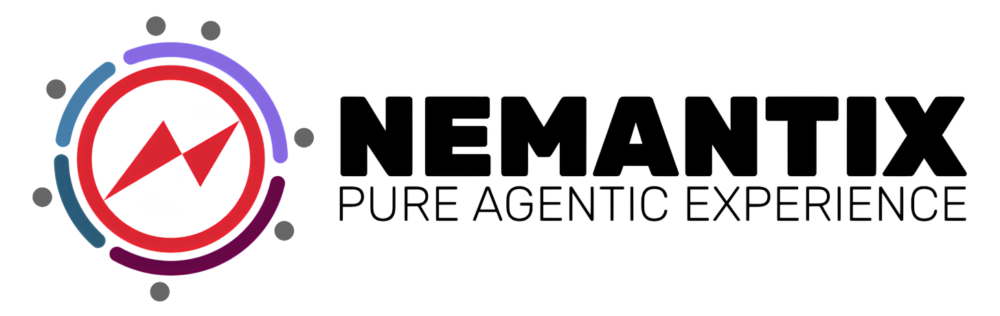
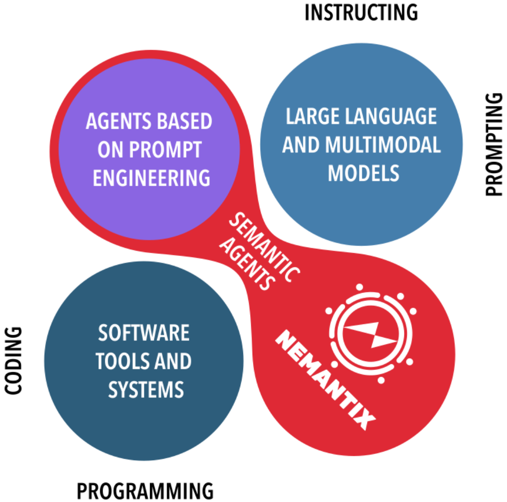
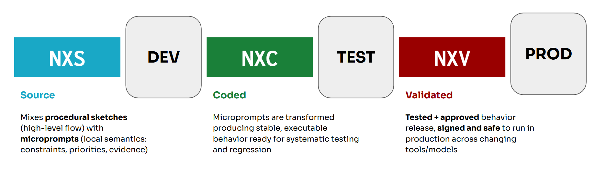

<p align="center">
  
</p>


---

## 📌 A New Agentic AI Paradigm

**Nemantix** introduces a new foundation for building intelligent agents.

Instead of treating agents as prompt-driven black boxes, Nemantix is built around **Semantic Agents** — systems whose behavior is grounded in explicit meaning, structured intent, and verifiable execution.

## 💡Why Nemantix?
_Is it just another agentic platform among the tens of agentic platforms?_ 🤔 <br>
The answer is **NO**, not if _agentic platform_ means “a pile of prompts duct-taped to a tool-calling loop,” and then hoping nothing weird happens once it starts touching real systems.😅

Most _agentic platforms_ today are an extension of **Prompt Engineering**: you craft instructions, tune templates, and judge what the model did *after the fact*.

That approach works when the risk surface is mostly **text quality**.

But as soon as agents begin to call tools, trigger workflows, modify data, interact with external systems etc., the primary risk is no longer *bad text*, but wrong actions, policy violations and undesired side effects.

Prompting still matters — but it’s not sufficient as the governing layer for real-world agents.

Nemantix addresses this gap with a new paradigm: **Semantic Agents**.


### What makes Nemantix different

Semantic Agents are not just language-driven orchestrators.
They are systems whose behavior is:

- **Structurally defined** (not “emergent” from prompts alone)
- **Semantically bounded** (clear limits on meaning and intent)
- **Operationally governed** (rules, constraints, and execution discipline)
- **Continuously verifiable** (not only evaluated post-hoc)


### Why this matters

When agents can take actions, safety and reliability become engineering problems:

- **Determinism**: reduce ambiguity in how actions are formed and executed
- **Verifiability**: prove and enforce constraints during execution, not after
- **Inspectability**: make decisions and allowed actions auditable and traceable

Nemantix is built for agent behavior you can **trust, verify, and inspect** — not just outputs you can *review after the damage is done*.

At the core of this approach lies **Intentware**.

---

## 📌 What is Intentware?

**Intentware** drives agent behavior through **executable intent**, not static code.
Agents continuously align actions with goals, constraints, and evidence, adapting to evolving contexts while remaining verifiable.

<p align="center">
  
</p>


### NXS — The Intentional Language

At the core of Intentware is **NXS**, Nemantix’s intentional language.

- Specifies *what* agents should achieve, under which constraints, and within which semantic scope
- Combines **procedural sketches** (high-level flow) with **microprompts** (local, reusable semantic guidance)
- Keeps behavior precise, adaptable, and continuously verifiable

**Result:** agents are **intent-aligned, semantically grounded, and auditable**.


### From Intent to Validated Behavior
<p align="center">
  
</p>


---

## 📌 Platform Features Overview


**Nemantix** provides a scalable infrastructure for designing, coordinating, and monitoring intelligent AI agents capable of:

- 🧠 Planning and executing complex tasks
- 🔄 Collaborating with other agents
- 🌐 Interacting with APIs and external systems
- 📊 Analyzing structured and unstructured data
- ⚙️ Running autonomous workflows

### Core Components
- **Agent** – An intent-driven autonomous entity that coordinates reasoning, execution, memory, and tools to achieve declared goals
- **Executor** – Decision-making engine responsible for action selection
- **Expertise** – Orchestrates NXS expertise
- **Coder** – Transforms NXS Intents into executable NXC code
- **Runtime** – Executes NXC specifications
- **Knowledge Base** – Semantic memory layer for knowledge retrieval
- **Operational Memory** – Associative memory supporting runtime execution
- **Standard Toolset Library** – Ready-to-use tools for API and system integration

### Project Structure
- `docs`: Project documentation
- `src/nemantix`: Core components, toolset, LLM proxies, and security features.
- `examples`: NXS examples.
- `plugins`: Plugins for third-party applications (e.g., syntax highlighters).
  - [JetBrains](https://plugins.jetbrains.com/plugin/31773-nemantix-language)
  - [VSCode](https://marketplace.visualstudio.com/items?itemName=nemantix.nemantix)
- `test`: Unit and integration tests.

---
## 🚀 Get started
### 📦 Installation

```bash
cd nemantix
pip install .

# OR 
# pip install .[all] to install all optional packages
```
### 🤖 Create an Agent
The agent is the main entry point for executing Nemantix scripts given a request.
For more information refer to the documentation [agent section](./docs/06%20-%20Agents.md).

### Textual (uncoded) request
In general, the agent answers requests expressed by the user in natural language.
In this case, the agent selects the best deliberate to execute (if a suitable deliberate exists at all,
otherwise it warns the user) and extracts possible inputs (for the selected deliberate) contained in the
request itself.

```python
from pathlib import Path
from nemantix.core import Agent, Expertise
from nemantix.security.verifier import DebugVerifier, Verifier

# verification of signed NXV scripts
verifier = DebugVerifier()  # use for development
verifier = Verifier(public_key_path='path-your-key')  # for production

# see: docs/06 - Agents.md for full instantiation options
exp = Expertise.from_local_scripts(paths=['examples/ticket.nxs'],
                                   verifier=verifier)

# NXV verification occurs on agent instantiation
agent = Agent(expertise=exp, build_on_start=True)

_, out = agent.run(user_request='Summarize the ticket "Ticket-BUG '
                                '<fix necessary for infrastructure orchestration code>"')

# > Found deliberate statement: "SummarizeSupportTicket"
print(out)

# > "ticket_summary" = label=BUG, lang=English\n summary=Short summary:
#    A fix is required in the infrastructure orchestration code to restore reliable, idempotent provisioning and deployments.
#
#    Key points:
#      - Problem: Orchestration logic is failing/intermittent, causing misconfigurations or blocked pipelines.
#      ...

# the same agent can answer multiple requests on the same script
_, ticket = agent.run(user_request='Create a ticket for "BUG" having issue '
                                   '"fix necessary for infrastructure orchestration code"'
                                   ' for the user_id "12345-NMX".')

# > Found deliberate statement: "GenerateTicket"

print(ticket)
# > Ticket
#   - Title: Fix required for infrastructure orchestration code
#   - Type: Bug
#   - Status: New
#   - Priority: To be determined
#   - Error Code: BUG
#   - Reporter/User: 12345-NMX
#   - Description: Fix necessary for infrastructure orchestration code.
#   ...
```

### 🛠️ Create a Toolset
Toolsets can be created in Python:
```python
from nemantix.core import Toolset, tool

class MyToolset(Toolset):
  @tool
  def say_hello(self):
      """Print hello"""
      print("Hello, agentic world!")
```
or generated starting from a textual description when an `.nxs` script is coded into an `.nxc`:
```
toolset ToolsetName:
>>> description of what the toolset is supposed to do <<<
__toolset
```
the coded toolset will be present in the resulting `.nxc` script.


### 📄 NXS example
For more details, refer to the documentation. Here is a short example:
```bash
from toolset NLP use entity_extraction
from toolset SupportRequests use send_request, fields_check

# global actions: shared by deliberates
@completion: frozen
action ProcessRequest >> process user text request <<:
    in:
    request >> user request
    __
    out:
    fields >> list of extracted fields or None
    __
    body:
    # example of fully-coded action
    do entity_extraction using [[request]=[request]] producing [[entities]]
    do fields_check using [[fields]=[fields]] producing [[check_ok]]
    if [![check_ok]]:
        return [none]
    else:
        return [fields]
    __if
    __body
__action

@breakdown: true  # tells the coder to generate deliberate-private actions
deliberate SendSupportRequest when >> the user needs to send a support request <<:
  guidelines:
    >> Use the request to extract the needed info to open a support request. Then, send the request.
  __
  
  # private actions will be generated here
  
  @completion: drafted->frozen  
  plan:
    in:
        fields >> list of info processed from the original request
    __
    out:
        status >> whether the request has been sent (boolean)
    __
    body:
        # example of micro-prompt
        >> Process the request and send the support request with the extracted fields.
    __
  __plan
__deliberate
```

### Debugging and Profiling
The execution of scripts can be debugged and profiled thanks to the EventHub:
```python
from nemantix.core import Expertise, Agent
from nemantix.hub import Debugger, Profiler
from nemantix.security.verifier import DebugVerifier

# Instantiate the components
debugger = Debugger()
profiler = Profiler()

# Attaching the event-hub to the expertise enables 
# automatic debugging on breakpoints and raised errors
# NOTE: insert "do breakpoint" in your script at relevant lines
exp = Expertise.from_local_scripts(paths=['examples/ticket.nxs'],
                                   verifier=DebugVerifier(),
                                   observers=[debugger, profiler])

# same as before
agent = Agent(expertise=exp, build_on_start=True)
# ...

# Profiling, instead, is explicit - after the execution ends:
profiler.print()
```

### 📑 Documentation
Read the full documentation in [docs/](docs/00%20-%20Welcome%20to%20Nemantix.md).

### 📚 Tutorials

Ready to build with Nemantix? Check out our step-by-step guides:

* 👉 **[Nemantix Tutorials](./tutorials/README.md)** – Find the complete hands-on learning path, including the environment setup guide, the LLM Proxy configuration, and end-to-end practical tutorials.

---
## ⚖️ License and Owner
Nemantix is licensed under the _**Nemantix Source Available License Agreement**_ **(NSAL)**. The full license is available [here](LICENSE.md). <br>
* The JetBrains and VSCode plugins in the `plugins/` folder are licensed under the Apache 2.0 license.

<p align="center">
  
</p>


This project is owned and maintained by [**Kebula**](https://www.kebula.it/).


---
## 🏗️ Work in progress
Nemantix is being actively developed; the core is fully working, with more capabilities coming soon.
