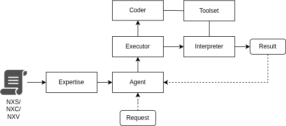

## Core Components

Nemantix is built as an agentic pipeline where **intent → decision → compilation to executable spec → execution → memory** forms a continuous loop. The components below are not isolated modules: they work together so an Agent can plan, act, observe results, learn, and iterate until a goal is satisfied.

  

### Agent
The **Agent** manages user requests end-to-end by connecting **expertise** knowledge with **execution**. It interprets the user’s intent, and then coordinates the *Executor*, *Coder*, and *Runtime* to turn expertise knowledge into concrete actions.

---

### Executor
The **Executor** receives requests from the **Agent**. These requests may arrive either as **free-form text** (to be interpreted) or as **NXS code** (to be parsed and executed directly). From there, the Executor drives the operational path to completion:

- **Interpretation / normalization:** it interprets the incoming request (text or NXS) and turns it into a structured form suitable for execution planning.
- **Deliberate selection:** it chooses which **Deliberate** to apply. The *Deliberate* is the primary construct in NXS (see the dedicated page).
- **Execution (via Interpreter):** once a Deliberate and an executable plan are selected, it forwards the resulting specification to the **Interpreter** to run the request and produce observable results.

In short, the Executor is the decision-making hub that transforms Agent-issued requests into an appropriate **Deliberate**, compiles them when required, and triggers execution through the Interpreter.

---

### Expertise
**Expertise** is the **NXS orchestrator**. It provides a semantic coordination layer that abstracts over the underlying representations—**NXS**, **NXC**, and **NXV**—so higher-level reasoning and planning can remain consistent even when the concrete encoding or runtime representation changes.
The Expertise acts as the bridge between intent-level semantics and execution-level artifacts.

---

### Coder
The **Coder** uses an **LLM** to transform *microprompts* into **executable logic**. It is used both:
- for an initial **NXS encoding** phase (turning interpreted intent into NXC) by the Expertise, and
- to **complete or refine NXC logic at runtime**, leveraging the current user request and execution context when parts of the plan need to be materialized on the fly.

How the Coder encodes a request is not fixed: the produced output varies according to the **qualifiers** associated with the **plan** and with individual **actions** (see the NXS page). These qualifiers steer *what kind* of code/spec is generated (e.g., strict vs. flexible behaviors, constraints, validation steps, tool usage patterns), ensuring the resulting NXC is aligned with the intended execution semantics.

---

### Runtime
The **Runtime** executes **NXC** specifications and turns decisions into real operations:
- interprets NXC as a sequence of operations,
- invokes tools, APIs, and system integrations,
- manages state, intermediate outputs, errors, and (when defined) rollback,
- emits execution traces and signals used by the Executor to refine the plan.

**Key responsibilities:** reliable execution, error handling, observability (logs/events), isolation and safety.

---

### Operational Memory
The **Operational Memory** is an associative, run-oriented memory optimized for **execution continuity**.
Items stored in the operational memories are characterized by an **identifier**, a **value**, a **semantics**, and an
optional **value semantics**:
* **Identifier**: allows to retrieve the corresponding **value** by name.
* **Semantics**: the name semantics explains what the variable should be used for.
* **Value semantics**: the value semantics is optional and meant to describe the current value for an identifier.

---

### Knowledge Base
The **Knowledge Base** stores and retrieves documents by seamlessly combining dense vector search with a Knowledge Graph. 
Ingested documents are segmented into their logical parts, forming a hierarchical tree where each node is enriched with 
a semantic summary and embedded in a vector database. Thanks to this dual architecture, the Agent can instantly pinpoint 
the most relevant sub-components via vector similarity, and then navigate the graph's topology to gather the exact surrounding
context needed to answer user queries.

---

### Standard Toolset Library
The **Standard Toolset Library** provides ready-to-use tools for integrating with:
- external APIs,
- internal systems,
- compute and storage resources,
- automation and connectors.

It’s what makes the Agent capable of acting in the world: the Runtime invokes tools from this library, and the Executor factors tool availability into its decisions.

---
Next: [NXS language](./03%20-%20NXS%20language.md)
