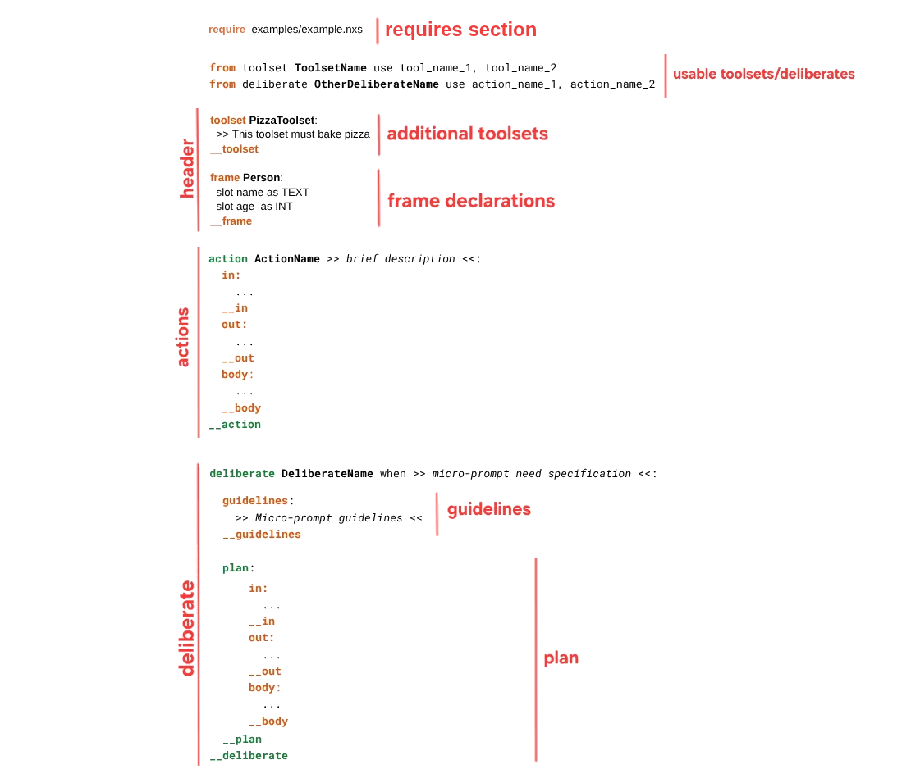

# NXS as an Intentional Language

NXS is the core **Intentional Language** of Nemantix.
Its purpose is not to program machines in the traditional sense, but to specify **intentions**: what an agent is supposed to achieve, under which constraints, and within which semantic perimeter.

Where classical programming languages focus on *how* to execute a sequence of operations, NXS focuses on *what* needs to be accomplished and under what behavioral assumptions an AI-enabled system should operate.

NXS mixes procedural sketches with microprompts:

- **Procedural sketches** outline the intended flow at a high level (plans, actions, control flow, tool calls).
- **Microprompts** are small, reusable pieces of natural-language guidance embedded inside a larger specification. They inject local semantics—constraints, priorities, definitions, examples, evidence requirements—right where decisions are made, keeping behavior precise without turning the whole spec into low-level code.

---

# NXS Structure

An NXS script is made by a header where you can (optionally):
- `require` other nxs scripts
- declare additional `toolset`s that will be completed by the agent if needed.
- declare `frames` (see dedicated section)

The core unit of a NXS script is the `deliberate`. It encapsulates a solution to a specific **need** by defining a `plan`, a structured sequence of `action`s that collectively solves a well-scoped problem.
An NXS script can have one or more deliberates.

<p align="center">
  
</p>

### Toolsets and dependencies
Declares which **toolsets** (and optionally other `deliberate`s, see next) are 
_globally_ available to specified actions and deliberates.

### Actions

Each `action` defines:

- **Inputs (`in`)**: required/optional data for the action to run,
- **Outputs (`out`)**: produced artifacts/results that downstream actions can consume,
- **Body (`body`)**: executable logic.

The body can be expressed in two complementary ways:

- **Microprompt-based logic**: a short natural-language instruction to be completed/compiled by the Coder into executable form (useful when the exact logic depends on context).
- **Fully specified logic**: expressions, loops, conditions, tool calls, `return`, etc., executed deterministically by the interpreter.

> Actions outside the `deliberate` are _globally_ available to other deliberates within the same script. Instead, actions
> defined within a `deliberate` are not accessible to outside deliberates, being _private_ to it.

### Deliberate

A `deliberate` provides four key elements:
1. **Need binding (trigger)**: declares `when` this deliberate should be considered applicable (which user/system need it satisfies).
2. **`guidelines`**: describes the intended behavior at a semantic level — what must happen and in what order/logic — without necessarily prescribing implementation details.
3. Internal actions: i.e., generated `action` definitions that are private of a specific deliberate.
4. **`plan`**: a set of statements and `action` calls (either global or private) that implement the behavior described in the guidelines.


#### Guidelines

The `guidelines` section is a contract for the plan: it specifies expected flow and invariants.
The Executor/Coder should treat guidelines as the ground truth for what the plan must achieve, even if actions are partially generated or completed at runtime.

#### Plan

Similarly to actions, the plan defines:
- **Inputs (`in`)**: required/optional data for the deliberate to run,
- **Outputs (`out`)**: produced results that the callee can consume,
- **Body (`body`)**: executable logic, made of statements and calls to private and global actions.
---

# NXS Syntax

## Requires

NXS files can require (include) other NXS/NXC files at the top level:

```nxs
require ./common.nxs
require ../actions/send_request.nxc
```

## Toolset imports

You can import tools from a toolset by specifying their names.
You can import all targets using `*`.

```nxs
from toolset ToolsetName use tool_name_1, tool_name_2
from toolset AnotherToolsetName use *
```
Toolsets can be instantiated with arguments and optionally aliased:

```nxs
from toolset SQLToolset as DBToolset with ["DB_URI"] use connect
```

- `as` defines an alias for the instantiated toolset.
- `with` passes arguments (as an expression) to the toolset instance.

> Note: `with` is supported **together with** `as` (i.e., `as Alias with [...]`).


## Comments

```nxs
# inline comments are supported with '#'
```

---

## Microprompts

A microprompt can be expressed in three ways:

- **Line prompt**, ends at end-of-line:

```nxs
>> text of microprompt
```

- **Inline guarded prompt**, ends with `<<`:

```nxs
>> text of microprompt <<
```

- **Multiline prompt block**, delimited by `>>>` and `<<<`:

```nxs
>>> multiline
text <<<
```

---

## Block delimiters

Each block has a start delimiter (e.g. `guidelines:`, `in:`, `out:`, `plan:`, `body:`) and can be terminated by:

- the generic terminator `__`, or
- a specific terminator such as:
  - `__guidelines`
  - `__in`
  - `__out`
  - `__plan`
  - `__action`
  - `__body`
  - `__do`
  - `__repeat`
  - `__if`
  - `__toolset`
  - `__frame`
  - `__use`
  - `__deliberate`

---


## Plans and actions

### Plan and action qualifiers

Plans and actions can be qualified with a special annotation `@completion`. 
There are three qualifiers:
- `undefined`
- `drafted`
- `frozen`

Example:

```nxs
@completion: drafted->frozen
plan:
  body:
    # ...
  __body
__plan
```
> The plan completion level can be either specified on top of the `plan` declaration, or on
> the respective deliberate.

The `completion` annotation supports the following syntax:
+ `@completion: drafted->frozen`: initial qualifier is `drafted` and requested (final) completion level is `frozen`.
+ `@completion: _->frozen`: use `_` to ignore the initial completion level, and only care about the target completion.
+ `@completion: drafted->_`: in this case, it evaluates the final completion level according both the start qualifier and the implemented statements, 
trying to complete as much as possible.
+ `@completion: frozen`: this is a shorthand for `@completion: frozen->frozen`, when the initial and final levels are the same.

> If `@completion` is not specified, the qualifier is automatically inferred by default.

### Qualifiers meaning and impact on NXC coding
Plan and action qualifiers are intended to instruct the developer on the level of completion required.

#### Plan qualifiers

* **Frozen**: The NXS must be fully completed. The resulting NXC will be final, and no additional coding will be required.
* **Drafted**: The NXS is a draft used to generate a plan that can be modified at runtime if needed.
* **Undefined**: No actions are specified in the plan. A draft will be generated and modified at runtime.

#### Action qualifiers

* **Frozen**: This action must not be implemented. It must be copied into the NXC exactly as-is and must never be modified.
* **Drafted**: This action is partially implemented and must be implemented in the NXC, with any remaining parts completed at runtime if necessary.
* **Undefined**: No instructions are specified in the action body. A draft will be generated and modified at runtime.

Plan and action qualifiers can be combined to achieve the desired coding behavior.

### Action definition

```nxs
action ProcessRequest >> process user text request <<:
  in:
    request(required) >> user request <<
  __in
  out:
    fields >> extracted fields or none <<
  __out
  body:
    ...
  __body
__action
```


### Inputs (`in`) and outputs (`out`)

#### Inputs

Inputs support:

1. **Named inputs** (optionally with modifier and prompt):

```nxs
in:
  request (required) >> must be provided
  limit (default [10]) >> default limit
__in
```

2. **Unnamed inputs** (prompt-only):

```nxs
in:
  >> unnamed input <<
__in
```

3. **Unnamed inputs with modifier**:

```nxs
in:
  (optional) >> optional unnamed input <<
__in
```

You can also specify `in: none` / `in: _` to indicate no inputs.

#### Outputs

Outputs support named and unnamed forms:

```nxs
out:
  status >> whether the request has been sent <<
__out
```

Or `out: none` / `out: _` for no outputs.


---

## Statements and control flow (action body)

An action `body:` contains a sequence of statements. Supported categories include:

- microprompt instructions (line or block),
- loops (`repeat ...`),
- conditionals (`if / elif / else`),
- function calls (`do ...`),
- expressions (including assignments),
- `return`, `break`, `continue`.

### Return / flow control

```nxs
return [value]
break
continue
```

---

## Expressions and variables

### Expressions

NXS supports common math and logical operations.

**Operator precedence order (lowest → highest):**

| Level | Symbols                          | Meaning                                                |
|------:|----------------------------------|--------------------------------------------------------|
|     1 | `=`                              | Assignment                                             |
|     2 | `,`                              | List creation (comma operator)                         |
|     3 | `\|`                             | Concatenation                                          |
|     4 | `??`                             | Fallback / null coalescing                             |
|     5 | `\|\|`, `^^`                     | Logical OR, Logical XOR                                |
|     6 | `&&`                             | Logical AND                                            |
|     7 | `!`                              | Logical NOT                                            |
|     8 | `==`, `!=`, `<`, `>`, `<=`, `>=` | Comparisons                                            |
|    8b | `~`, `~>`, `<~`                  | Semantic operators (similarity / semantic containment) |
|     9 | `+`, `-`                         | Sum                                                    |
|    10 | `*`, `/`, `%`                    | Product                                                |
|    11 | unary `+`, unary `-`             | Unary signs                                            |
|    12 | `^`                              | Power / exponentiation                                 |
|    13 | `f(...)`                         | Function application                                   |

All expressions are enclosed in square brackets: `[ ... ]`.

Examples:

```nxs
[[x] = 12]
[[y] = [x] + 3]
[[z] = ([a] ?? [b]) | " suffix"]
```

### Variables

Variables use square brackets and can be accessed through a path:

```nxs
[var]          # variable
[var:0]        # index access
[var:name]     # key access
[var:(expr)]   # expression access — field/index resolved at runtime
```

The expression access form evaluates any NXS expression inside the parentheses and uses the result as the field name or index. This allows dynamic, data-driven navigation of structures:

```nxs
[[struct]  = ("ciao", end: 4)]
[[field]   = "end"]
[[content] = [struct:([field])]]   # content = 4
```

### Prompted variables

A variable can include an inline prompt for verification/documentation:

```nxs
[[user_id >> must be hashed <<]]
```

(Inside variables, the prompt ends at `]`.)

---

## Types and literals

NXS is **not** strongly typed; values are dynamically shaped.

### Numbers

```nxs
[[var] = 12]
[[var] = 5.3]
[[var] = 23e6]  # 23 * 10^6
[[var] = -3]
```

### Booleans

```nxs
[[var] = true]
[[var] = false]
```

### Strings (with expansion)

```nxs
[[example] = "in Nemantix"]
[[var] = "with expressions and vars [example]"]
```

The second line expands to: `"with expressions and vars in Nemantix"`.

Because strings support expansion, square brackets must be escaped when you want a literal bracket:

```nxs
[[var] = "Use a literal bracket: \["]
```

### None

```nxs
[[var] = none]
[[var] = _]     # equivalent
```

---

## Collections (list/struct literals)

Collections are written as a parenthesized literal. They can behave like lists (indexed) and dictionaries (keyed).

```nxs
[[var] = (1, 2, 3)]
[[var:0] = 4]
[[var:name] = "Kebula"]
```

### Key/value + prompts + nesting

```nxs
[[x] = (>> the name of the person <<, surname:_, birth:(day:_, month:_, year:_))]

[[schema] = (
  name: _ >>> the name of the person <<<
  surname: _
  birth: (
    day: (type: "int"),
    month: _,
    year: _
  )
)]
```

> **Note on commas:** the grammar distinguishes grouping parentheses `(x)` from collection literals.
> A collection literal requires either commas, a `key: value` item, or a prompt-only element.

---
<a id="dostatement"></a>
## Tool / action / deliberate calls (`do`)

Calls are expressed with `do` and may be inline or block form.

### Inline call
The generic form is:
`do optional_qualifier name using [expr] producing [expr]` where:
- `optional_qualifier` must be one of `tool` (for tool calls) or `action` (for a specific action in a specific deliberate) or `deliberate` (to execute the entire plan of a deliberate, starting from the main action).
- `name` is the name of the callable. It can be qualified to specify which toolset/deliberate for tools and action.
- `using` and `producing` accept an **expression**.

```nxs
do tool NLP.entity_extraction using [[request]=[request]] producing [[entities]]
```

### Block call

```nxs
do tool SupportRequests.send_request:
  using [[fields]=[fields]]
  producing [[status]]
__do
```

- `tool` and `action` are optional type specifiers.

### Builtin functions
Builtin functions are special functions embedded in the language that can
be called without the `do` statement syntax but just within an expression.

Available builtins:
* `print(*args, **kwargs)`: prints to console the given arguments.
* `coalesce(*args, **kwargs)`: returns the first non-none (if any) among `args` and `kwargs`.
* `exists(x)`: returns `True` if `x` is not none; otherwise `False`.
* `size(*args)`: returns the `len()` of the given `args`.
* `type(x)`: returns a string describing the type of `x`.
Possible types are:
  * `none` for Python `None`;
  * `num` for integers and floats;
  * `str` for strings;
  * `bool` for booleans;
  * `struct` for Nemantix structures (`Struct`);
  * `doc` for Nemantix Document references (`DocRef`);
  * `opaque` for Nemantix `Opaque`.
* `substring(x, start, end)`: returns the substring of the given start and termination indices.
* `to_num(x)`: strict numeric conversion.
* `to_bool(x)`: strict Boolean conversion.
* `to_str(x)`: strict string conversion.
* `num(x)`: returns `None` if not castable to number.
* `bool(x)`: returns `None` if not castable to Boolean.
* `str(x)`: returns `None` if not castable to string.
* `sin(x)`: computes the sines of `x`.
* `cos(x)`: computes the cosine of `x`.
* `sqrt(x)`: computes the square root of `x`.
* `llm(prompt, **kwargs)`: invokes the internal LLM.

Knowledge base builtins:
- `retrieve(query, top_k=5)`: Used to retrieve information from the knowledge base. Returns a list of `DocRef`.
- `expand(node_id)`: Given a node id, retrieves its subnodes. Returns a list of `DocRef`.
- `extend(node_id)`: Given a node id, retrieves its (previous or next) siblings. Returns a list of `DocRef`, 
if there are no siblings the list will be empty.
- `generalize(node_id)`: Given a node id, retrieves its parent node. Returns a single `DocRef`.


### DO LLM Call

The `llm()` builtin function can be used in a do-statement as usual, where the LLM's response is provided as a string
by default:
```
do llm using ["Extract the ticket content: " | [text]]
                   producing [[content]]
```
Use the optional `as` syntax working on `frames` to format the output response
according to the provided schema:

```
frame Ticket
  slot content as TEXT[1]
  slot id as INT[0..1]
__frame
...

do llm using ["Extract the ticket content: " | [text]]
       producing [[content]] as {Ticket}

# [content] is now a struct with "content" and "id" fields.
```


---

## Conditionals

```nxs
if >> condition <<:
  ...
elif [expr]:
  ...
else:
  ...
__if
```

Conditions are **prompted expressions**: either an expression optionally followed by a prompt, or a prompt alone.

---

## Loops


### Repeat each (iterate a collection)
Iterates over a structure yielding the current iteration number `i` and
value `item`:

```nxs
repeat each [iterable] as [i], [item]:
  ...
__repeat
```

- iterable is a **prompted variable** (variable or prompt),
- optional `as [i], [item]`.

### Repeat N times
Numeric loop:
```nxs
repeat 10 times as [i]:
  ...
__repeat
```

### Conditional repeat (while/until) with optional max iterations
While or repeat until loop:
```nxs
repeat while >> condition << max 100:
  ...
__repeat
```

---


## Advanced constructs


### Intentable Prefix: Labels and Meta

Many language constructs (`frame`, `slot`, `toolset`,
`deliberate`, `action`, `guidelines`, `plan`, `body`, `import` and `prompt`)
can be prefixed with an optional **label** and/or one or more **meta declarations**,
allowing the user to specify a variety of metadata:

#### Labels

```nxs
{MyLabel}
```

#### Meta declarations

```nxs
@namespace.name: "value"
@notes: >> short prompt <<
```

Meta values can be: prompts, expressions, strings, numbers, booleans, `none` (`none` or `_`), or qualified names.

Example usages:
```nxs
# frame with intetables
{expl}
@intent.goal: "Explain a topic"
@intent.audience: "non_expert"
@frame.purpose: >>Frame to parameterize an exaplanation<<
frame EXPLANATAION:
    slot topic as TEXT[1] >>topic to discuss<<
    slot depth as ENUM("short","medium","deep")[1] >>detail level<<
__frame

# deliberate with intentables
{d_sum}
@intent.goal: "Summarize a document"
@quality.min_conf: [0.75]
@completion: frozen
deliberate summarize when >>...<<:
    {a_write}
    @intent.style: "executive"
    plan:
        body:
            >> write a concise summary <<
        __body
    __plan
__deliberate
```
There are special annotations like `@completion` and `@breakdown`:
+ The `@completion` can be only applied on `deliberate`, `plan` and `action` declaration, specifying the desired coding level.
+ The `@breakdown` is deliberate specific. If enabled, i.e., `@breakdown: true`, it instructs the coder to generate
deliberate-private actions within its definition. When omitted, this feature is disabled by default.

Moreover, annotations involving the `intent` namespace like `@intent.goal` can be shorthanded to `@goal`, 
hence omitting the `intent` namespace.

## Frames and slots

Frames provide reusable semantic schemas; slots define named fields with types and cardinality.

### Frame

```nxs
frame Person:
  slot name as TEXT[1]
  slot age as INT[0..1]
__frame
```

We can have nested frames as well:
```
frame Employee:

  # inner frames can be defined too
  frame DATE:
     slot day as INT [1]
     slot month as INT | TEXT [1]
     slot year as INT [1]
  __

  # a slot represents a frame's field
  slot name as TEXT | INT [0..*]
  slot surname as TEXT | STRUCT [1]
  slot birthday as TEXT | DATE | ENUM("N/A","n.d.")

__frame
```

### Slot types

Slot types are one or more of:

- `TEXT`
- `INT`
- `FLOAT`
- `BOOL`
- `STRUCT`
- `ENUM("a","b","c")`
- another frame name (e.g., `DATE`)

Examples:

```nxs
slot id as TEXT | INT[1]
slot priority as ENUM("low","medium","high")[1]
slot owner as Person[1]
```

### Cardinality

Cardinality uses the grammar token:

- `*` (any)
- `n` (exactly n)
- `n..m` (range)
- `n..*` (at least n)

Examples:

- `[1]`
- `[0..1]`
- `[1..*]`
- `[*]`

---

## Frame application on structures

A structure can be annotated with a frame (semantic typing) either as prefix or suffix:
- **Prefix application** requires the Structured Collection to conform to the frame definition;
- **Postfix application** interprets the structure in the context of the frame, even if it is partial or incomplete.

Frame application returns a new structure that respects the frame definition, 
or `none` if it is not possible to do so.

```nxs
[[p] = {Person}(name:"Ada", age:36)]
[[q] = (name:"Ada"){Person}]
```

---

## Meta expressions

Meta expressions allow you to reference meta-bound values:

```nxs
{{name@some.qualified.meta}}
```

---

## Semantic operators (similarity & containment)

Beyond classic comparisons, NXS provides semantic operators **for strings and documents**:

- Similarity: `a ~ b`
- Similarity with qualifier: `a ~ <qual> ~ b`
- Semantic “in”: `a ~> b`
- Qualified semantic “in”: `a ~ <qual> ~> b`
- Reverse semantic “in”: `a <~ b`
- Qualified reverse semantic “in”: `a <~ <qual> ~ b`

Qualifiers can be keywords or a number:

- `far`, `loose`, `about`, `close`, `strict`
- or a numeric threshold between 0 and 1

Examples:

```nxs
[[ok]  = ([query] ~ close ~ [title])]
[[ok2] = ([tag] ~> [taxonomy])]
[[ok3] = ([value] <~ 0.8 ~ [cluster])]
```

---

## DocRef
A `DocRef` represents a document chunk, retrieved through the Nemantix Knowledge Base 
(see the related [docs](./08%20-%20Knowledge%20Base.md) for further info.)
In practical terms, a `DocRef` is a collection (i.e., a `Struct` supporting the same syntax) 
with the following fields:
* `node_id`: a string representing the identifier of the document chunk;
* `score`: a (optional) float retrieval score;
* `content`: the string content of the chunk;
* `breadcrumbs`: a formatted string representing the "path" where the chunk is located within the original document.

> `DocRef` are read-only `Struct`, you can access their fields as usual but not edit their content.
> Also, "append" i.e., `[doc] | "string"` returns the `[doc]` unchanged, whereas the "union"
> `[doc_1] | [doc_2]` returns `Struct` (not a `DocRef`) with a `content` field, having the contents of both chunks.

In addition, 'DocRef' supports the similarity operator (`~`) againsts both a string or another `DocRef`.

Next: [Script Lifecycle](./04%20-%20Script%20Lifecycle.md)
